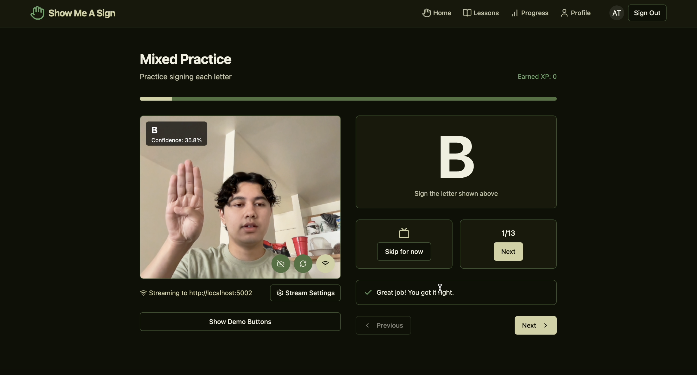
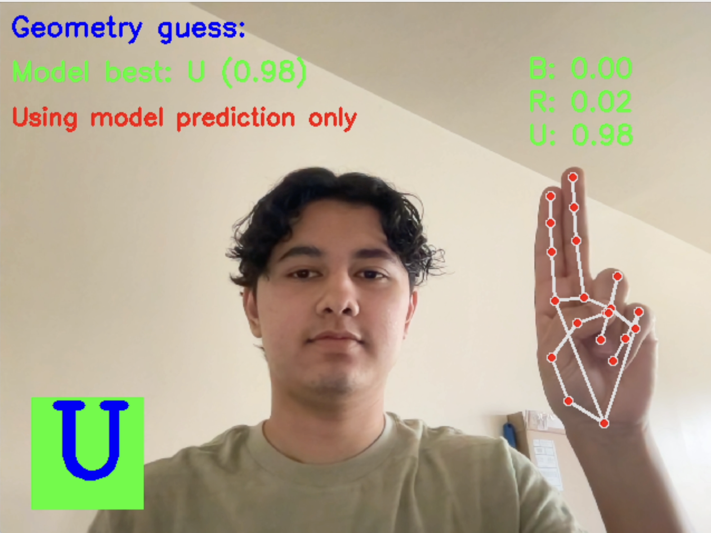
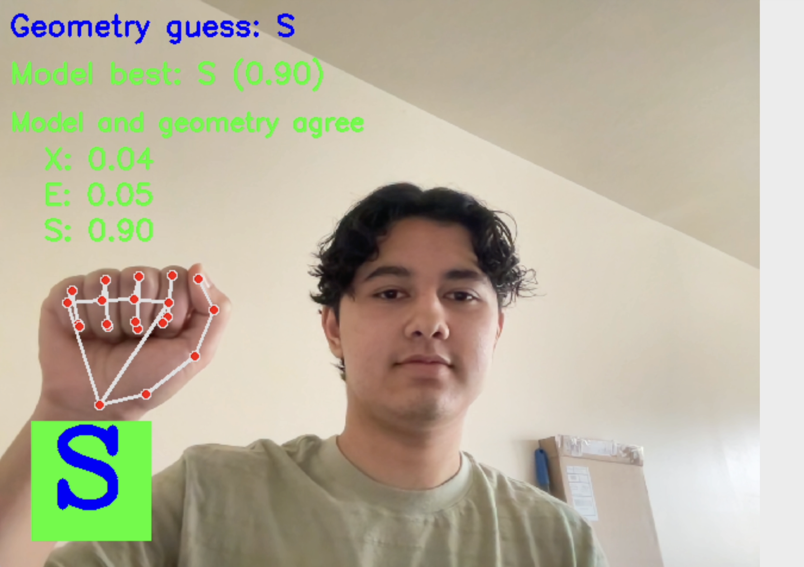
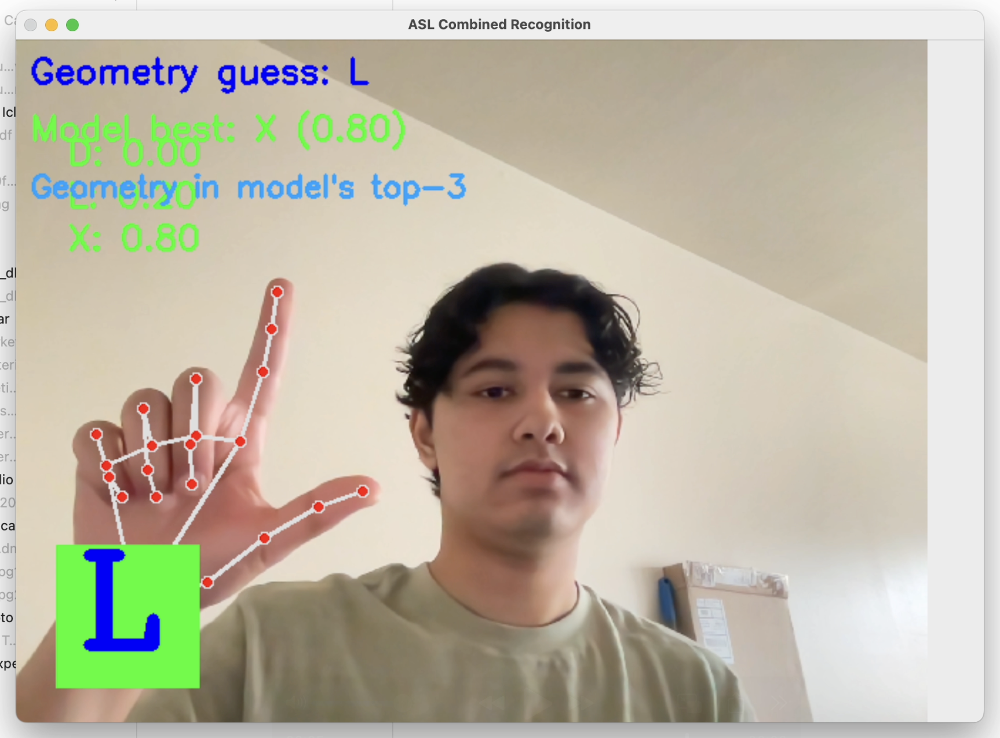

# Show Me A Sign - An Interactive ASL Learning Platform

## Video Demos
Full App Walkthrough: https://youtu.be/MBmjt37I5aQ

Backend Demo (Detection + Prediction): https://youtu.be/IXH82lJ658s

## Project Overview

Show Me A Sign is an interactive web application designed to help users learn American Sign Language (ASL) through real-time webcam interaction. Using computer vision and machine learning, the platform provides immediate feedback on sign language gestures, helping users practice and master ASL.

### Key Features

- **Interactive ASL Learning**: Practice ASL signs with real-time feedback through your webcam
- **Structured Lesson Pathways**: Progress from alphabet to numbers and phrases
- **User Progress Tracking**: Track your learning journey with XP, achievements, and accuracy metrics
- **Adaptive Difficulty Levels**: Content organized by beginner, intermediate, and advanced levels
- **Visual Learning Aids**: Clear demonstrations of signs with practice opportunities
- **Real-time Sign Recognition**: Advanced ML model detects and evaluates hand signs

## Technical Architecture

The application consists of two main components:

### 1. Frontend (React + TypeScript)
- Built with React, TypeScript, and Vite
- UI components with shadcn/ui and Tailwind CSS
- Real-time webcam streaming with WebRTC
- User authentication and progress tracking via Supabase

### 2. Backend (Python + Flask)
- Hand tracking using computer vision (MediaPipe and OpenCV)
- ASL recognition with our custom-trained TensorFlow Keras model
- Real-time machine learning prediction with both CNN model and MediaPipe geometry-based analysis
- Flask-based WebSocket server for processing webcam frames

### 3. Model Training (TensorFlow + OpenCV)
- Trained on a custom grayscale ASL wireframe dataset (~20,000 images, subset of https://www.kaggle.com/datasets/dylanpallickara129/asl-alphabet-wireframes)
- Dataset augmented manually by mirroring images and various transformations using TensorFlow `ImageDataGenerator`
- CNN architecture with 3 Conv+Pooling layers, dropout, and dense layers
- 80/20 train-test split with stratified sampling
- Model saved in `.h5` format with class mapping and training visualizations

### Images







## Usage

Follow these steps to set up and run the project locally.

### 1. Clone the Repository
```bash
git clone https://github.com/your-username/your-repo-name.git
cd your-repo-name
```

### 2. Set Up Python Environment
Create and activate a virtual environment:
```bash
python3 -m venv venv
source venv/bin/activate  # On Windows: venv\Scripts\activate
```

Install Python dependencies:
```bash
pip install -r requirements.txt
```

### 3. Run the Backend (Python)
In the **same terminal and virtual environment**, run:
```bash
python3 app.py
```
This will start the backend server.


### 4. Set Up the Frontend (Node.js)

In a **new terminal**, **do not activate the Python virtual environment**.

1. Install Node.js LTS version (22.4 recommended) using `nvm`:
```bash
nvm install --lts
```

2. Install frontend dependencies:
```bash
npm install
```

3. Start the frontend development server:
```bash
npm run dev
```

- The **backend** (Python) will be running from your first terminal.
- The **frontend** (Node.js) will be running from your second terminal.

> 💡 Keep both terminals open for full functionality while developing.


